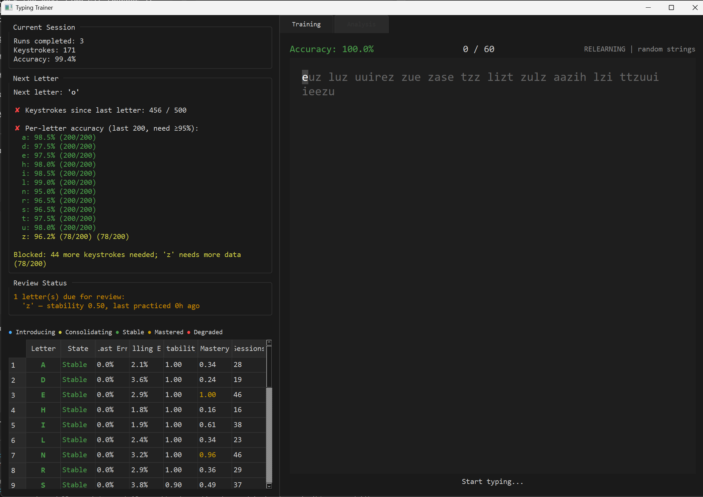

# Typing Trainer

A desktop typing trainer built on motor learning principles. No gamification, no badges, no streaks — just systematic training to build correct finger-to-key motor patterns.



## How It Works

If you want to learn typing on a keyboard, this program is for you.

I built it when I switched to a split keyboard and had to relearn everything. I could type okay on a normal keyboard (~40-50 WPM) but never learned proper touch typing.

This program is based on motor learning theory. Learning to type means learning a motor skill. Motor skills develop in three stages:

**1. Cognitive stage:** Every movement requires conscious effort. Even pressing a single letter takes real thought.
Precision is key. Every keypress trains your brain — including the wrong ones. Especially in this early stage, errors get baked in to some degree. Therefore: precision before speed.

**2. Associative stage:** Movements start to become easier. Your finger begins to know where to go before you consciously think about it. But you can still be easily distracted. Speed comes from your motor system learning to plan ahead and chain letters together — not from trying to move faster.

**3. Autonomous stage:** With enough training, typing becomes effortless — as natural as speaking.

---

### Learn Keys

Random letters are generated. No real words — your brain needs to build motor patterns for individual keys first. Backspace is disabled to force commitment to each keystroke.

**Important:** Take your time. Be precise. Letters are introduced one by one. A new letter is unlocked when:
- All previous letters have >95% precision over the last 200 keypresses
- At least 500 keypresses have passed since the last unlock

Letters are weighted: new letters and those with low precision appear more often.

**Hints:**
- Practice daily. Short daily sessions beat long occasional ones — even with the same total practice time.
- Use medium-length runs with short breaks in between.
- If you notice increasing errors or your timing becomes erratic, take a real break. Practicing while mentally fatigued doesn't help.
- Sit comfortably.
- Try saying, whispering, or mouthing the letters as you type. This often helps with precision in this stage.
- Letters are truly random. There is no profanity filter.

### Fix Keys *(optional)*

Select a few specific letters to train them in isolation. Default selection: a mix of your weakest and a few strong letters.

### Build Speed

Real words instead of random letters. I'd recommend finishing Learn Keys first — meaning: all letters unlocked.

By that point, you'll likely be partially in the associative stage already. This mode lets you practice with real language, where your brain already knows the words.

Don't force speed. Keep focusing on accuracy — speed emerges on its own as your motor system learns to plan ahead and chain movements together.

### Smooth Pairs *(optional)*

Slow letter pairs (bigrams) can be a bottleneck for speed. In this mode, words are selected to contain specific bigrams you want to practice. For very slow bigrams, you can also practice them as isolated pairs before moving to words.

Which bigrams to train can be chosen in the analysis view, based on your speed and error data.

### Keyboard Shortcuts

- **Return/Enter** — Start a run from the config screen, or continue from the summary screen
- **Escape** (double-press) — Abort the current run (discarded, not saved)

### Display Modes

The display mode selector at the top of the window controls how much detail is shown:

- **Basic** — Training panel only. Minimal run summary, no sidebar or analytics.
- **Nerd** — Sidebar with training status and letter overview. Core analytics charts. Per-letter breakdown in run summary.
- **Extreme Nerd** — Everything visible: all analytics charts, intra-run speed chart, error deep-dives. Proceed with caution. Some plots might not carry much information but rather statistical noise.

---

## Installation

```bash
# Clone the repository
git clone https://github.com/ChristianHonisch/typing-trainer.git
cd typing-trainer

# Install dependencies with uv
uv sync

# Run the application
uv run typing-trainer
```

If you don't have `uv`, install it first:

```bash
pip install uv
```

### Requirements

- Python >= 3.14
- PyQt6 >= 6.7
- pyqtgraph >= 0.13

## Configuration

Settings are stored in `training-data/config.json`, created automatically on first launch. Key parameters:

| Parameter | Default | Description |
|---|---|---|
| `language` | `"de"` | `"de"` for German, `"en"` for English |
| `advancement_accuracy` | `0.95` | Per-letter accuracy threshold for advancement |
| `advancement_accuracy_window` | `200` | Rolling window size (keystrokes per letter) |
| `advancement_min_keystrokes` | `500` | Minimum keystrokes before next letter introduction |
| `session_timeout_minutes` | `30` | Inactivity timeout for session boundaries |
| `rest_suggestion_seconds` | `10` | Rest countdown between runs |
| `default_run_length` | `50` | Default number of characters per run |

See [SPEC.md](SPEC.md) for the full parameter reference and design rationale.

## Data Storage

All training data is self-contained in the `training-data/` directory:

- `typing_trainer.db` — SQLite database with sessions, runs, keystrokes, letter states, and speed state
- `config.json` — User configuration

The database is portable. Copy the `training-data/` folder to migrate to another machine. Schema migrations run automatically on startup.

## Development

### Technical Overview

- **Error classification**: Cognitive errors, motor overflow (<80ms same-key), burst repeats (stuck keys), swap detection (transposed pairs)
- **Letter state machine**: Introducing → Consolidating → Stable → Mastered, with automatic degradation on accuracy drops
- **Speed staircase**: +2 WPM on pass, -4 WPM on fail — converges to a 67% success equilibrium
- **Spaced repetition**: Time-based decay on unused letters with configurable half-lives
- **QWERTZ layout** with German and English language support (lowercase only in v1)
- **Dark theme**, keyboard-driven UI

### Project Structure

```
src/typing_trainer/
  config.py              # All tunable parameters
  main.py                # Entry point
  models/                # Data structures (letter state, run result, session, error types)
  core/                  # Engine, text generator, letter manager, error classifier, speed manager
  storage/               # SQLite database + repository layer
  ui/                    # PyQt6 widgets, theme, charts
tests/                   # 411 tests
```

### Running Tests

```bash
uv run pytest tests/ -q --tb=short
```

### Type Checking

```bash
npx pyright src/ tests/
```

The project targets 0 pyright errors. Type stubs for PyQt6 and pyqtgraph are configured via `pyrightconfig.json`.

## License

TBD
